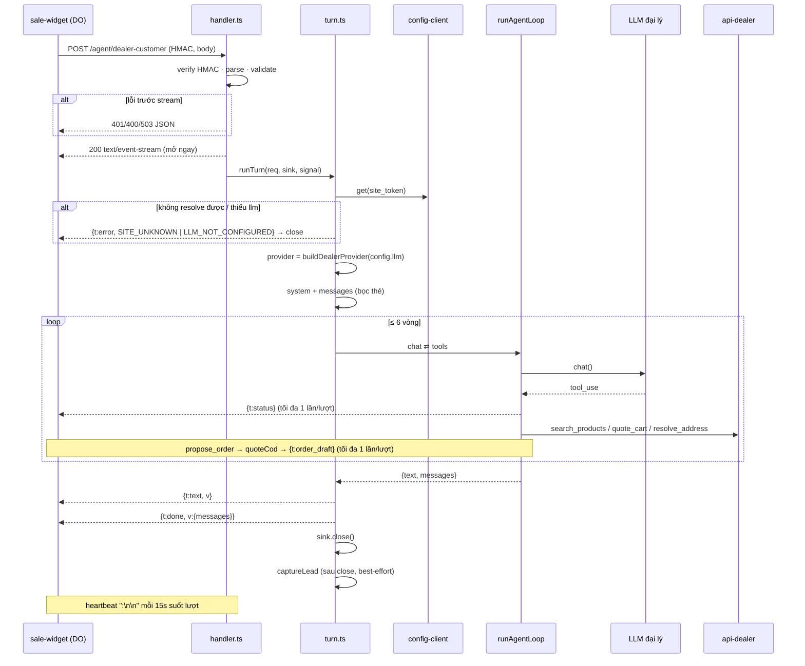

# 12. Luồng SSE đồng bộ `POST /agent/dealer-customer`

- **Ngày:** 2026-09-01
- **Trạng thái:** design, chờ triển khai
- **Hợp đồng gốc:** `dilim-system/docs/superpowers/specs/2026-09-01-dealer-customer-agent-webhook-design.md`
  (§4 request/response, §3 `propose_order`). File này là phần **dilim-agent** của hợp đồng đó:
  route sống ở đâu, một lượt chạy qua những gì, và core phải đổi chỗ nào.

---

## 1. Vì sao không tái dùng gateway

`message-ingest/gateway.ts` là ingress **async**: verify → history → broker → ACK 200. Câu trả lời
đi ra kênh qua worker + broadcaster, hàng chục giây sau. Khách chat trên web cần câu trả lời trên
**chính connection đang mở**. Hai luồng khác nhau ở mọi tầng:

| | `/webhook/:channel` (có sẵn) | `/agent/dealer-customer` (mới) |
|---|---|---|
| Kiểu | async, ACK ngay | sync, SSE tới khi xong |
| State | Redis history + Postgres identity | **không** — DO của widget giữ hết |
| Provider LLM | `deps.provider` chung cả app | **BYO của đại lý**, dựng theo `site_token` |
| Tool | port nội bộ (`orders`, `dealer`…) + service token | `DealerApiClient` với `api_key` của đại lý |
| Ngữ cảnh | `context/assembler.ts` (speaker, memory, summary) | widget gửi `LlmMessage[]` sẵn, chỉ bọc thẻ |
| Usage | `UsageMeter` → ngân sách công ty | không đo — key của đại lý |

⇒ Module riêng `src/dealer-customer/`, dùng lại **đúng ba thứ** của core: `runAgentLoop`,
`ToolRegistry`/`runToolCall`, `LLMProvider` impl. Không đi qua `AgentRegistry`, không qua
`build-agent.ts`.

## 2. Bố cục

```
src/
  http/
    server.ts                 # Bun.serve DUY NHẤT của process: routes → gateway | dealer-customer
  dealer-customer/
    index.ts                  # createDealerCustomerHandler(deps) → (req) => Response
    handler.ts                # HTTP: HMAC, parse, validate, mở SSE, gọi turn
    hmac.ts                   # verify x-dilim-timestamp + x-dilim-sha-256
    request.ts                # AgentTurnRequest + validateTurnRequest (boundary)
    sse.ts                    # EventSink: encode event, heartbeat, once-guard, close
    events.ts                 # AgentEvent (union theo spec §4.2), mã lỗi
    turn.ts                   # runTurn: resolve config → provider → context → loop → done → lead
    config-client.ts          # WidgetConfig từ server nội bộ, cache 60s theo site_token
    provider.ts               # buildDealerProvider(config.llm) — anthropic | openai | gemini
    context.ts                # port widget agent/{prompt,context}.ts: system + bọc thẻ tin khách
    lead.ts                   # port widget agent/lead.ts
    order.ts                  # OrderDraft, quoteCod, retailTotal
    dealer-api.ts             # port widget tools/dealer-api.ts (x-api-key, toWirePath)
    tools/
      types.ts                # DealerToolContext { api, senderId, orderCreated, emit }
      catalog.ts  pricing.ts  address.ts  propose-order.ts
    dealer-customer.test.ts
  llm/providers/openai.ts     # MỚI — port từ widget
```

**Lệch so với checklist spec §5:** spec ghi profile ở `agents/roots/dealer-customer.ts`. Không
làm vậy, vì `roots/` là thứ `AgentRegistry` dựng thành `ProfileRootAgent` với `deps.provider`
cố định, `memorySpec`, `assembleTurnContext` — đăng ký vào đó là bootstrap sẽ dựng một agent
không bao giờ chạy đúng (sai provider, `memoryWriters` dựng thừa). Prompt + tool list nằm ở
`dealer-customer/context.ts` + `dealer-customer/tools/`; `agentType = "dealer-customer"` chỉ
dùng làm prefix trace.

## 3. Một lượt — sequence



Ranh giới quan trọng: **trước 200 là JSON, sau 200 mọi thứ là event.** Widget chỉ có hai
nhánh xử lý — `!res.ok` → `AGENT_UNAVAILABLE`, còn lại đọc stream tới `done`/`error`.

## 4. Tầng HTTP

### 4.1 Mount route

`Bun.serve` hiện nằm trong `message-ingest/index.ts::startGateway` và chỉ nhận `fetch:
gateway.handle` (path khác `/webhook/*` → 404). Dời `Bun.serve` lên `src/http/server.ts`:

```ts
export function startHttpServer(input: {
  port: number;
  webhook: (req: Request) => Promise<Response>;
  dealerCustomer?: (req: Request) => Promise<Response>;   // undefined = route tắt → 404
}) {
  return Bun.serve({
    port: input.port,
    routes: {
      "/webhook/*": input.webhook,
      ...(input.dealerCustomer === undefined
        ? {}
        : { "/agent/dealer-customer": { POST: input.dealerCustomer } }),
    },
    fetch: () => new Response(JSON.stringify({ error: "not_found" }), { status: 404 }),
    // Bun mặc định 10s KHÔNG có byte nào là cắt kết nối. Heartbeat SSE 15s > 10s → phải nới.
    // 75s > trần lượt 60s của widget (§4.3 spec) để không bao giờ cắt trước widget.
    idleTimeout: 75,
  });
}
```

`startGateway` chỉ còn trả `gateway.handle`; `bootstrap/start()` gọi `startHttpServer`.
`idleTimeout` là **bắt buộc**, không phải tối ưu: thiếu nó thì lượt tool dài chết đúng giây thứ
10 dù heartbeat có chạy (Bun 1.3.x, `idleTimeout` mặc định 10s).

### 4.2 Guard HMAC (`hmac.ts`)

Khớp `ServiceHmacGuard` phía server: `sha256Hex(site_token + timestamp + SALE_WIDGET_HMAC_SECRET)`,
`|now − timestamp| ≤ 30 000 ms`, so sánh bằng `crypto.timingSafeEqual` (hex → Buffer, kiểm độ
dài trước). Thiếu header / lệch giờ / sai chữ ký → **401 JSON** `{ error: "invalid_signature" }`.
Không phân biệt ba nhánh ra ngoài (log thì có).

Chữ ký cần `site_token` nằm trong body ⇒ thứ tự bắt buộc: đọc body → parse JSON → lấy
`site_token` → verify → mới validate phần còn lại. Body sai JSON trước khi verify được → 400,
chấp nhận (không rò gì ngoài "JSON hỏng").

Ghi chú bảo mật, không đổi hợp đồng: chữ ký **không phủ** `text`/`messages`. Trong cửa sổ 30s
một request bắt được có thể replay với body khác. Kênh CF↔VPS là TLS nên chấp nhận ở bản này;
nếu sau muốn siết thì thêm `sha256(body)` vào payload ký — sửa hai bên cùng lúc.

### 4.3 Validate body (`request.ts`)

Boundary = untrusted. Validate tay, không cast:

| Trường | Luật | Lỗi |
|---|---|---|
| `site_token` | string, 1–128 ký tự | 400 `invalid_request` |
| `text` | string, trim, 1–2 000 ký tự (ép lại dù widget đã cắt) | 400 |
| `messages` | mảng ≤ 80 phần tử; mỗi phần tử `{role: 'user'\|'assistant', content: block[]}`; block chỉ nhận `text` (block khác **bỏ**, không lỗi — widget lưu `conversationOnly` nên đây là chuyện phòng thủ); tổng ký tự ≤ 40 000 | 400 |
| `tag` | string 8 hex hoặc null | 400 |
| `order_created` | boolean | 400 |

Trần `messages` là hàng rào chi phí duy nhất phía agent: key là của đại lý, nhưng VPS là của
mình — một widget bị chèn 10 MB history vẫn phải bị chặn trước khi tới model.

### 4.4 Trần đồng thời

Route sync chạy chung process với worker pool. Semaphore đếm lượt đang mở; đầy → **503 JSON**
`{ error: "agent_busy" }` (widget đọc thành `AGENT_UNAVAILABLE`). Mặc định 32, env
`DEALER_CUSTOMER_MAX_INFLIGHT`. Không rate-limit theo site ở bản này — allowlist origin ở widget
đã chặn nguồn lạ, HMAC chặn nguồn không phải widget.

## 5. SSE sink (`sse.ts`)

```ts
export class EventSink {
  private closed = false;
  private draftSent = false;
  private statusSent = false;
  private readonly heartbeat: Timer;

  constructor(private readonly controller: ReadableStreamDefaultController<Uint8Array>) {
    this.heartbeat = setInterval(() => this.raw(":\n\n"), HEARTBEAT_MS); // 15 000
  }

  /** Trả false khi event bị luật once/terminal chặn — tool đọc để báo lại model. */
  send(event: AgentEvent): boolean {
    if (this.closed) return false;
    if (event.t === "order_draft") { if (this.draftSent) return false; this.draftSent = true; }
    if (event.t === "status")      { if (this.statusSent) return false; this.statusSent = true; }
    this.raw(`data: ${JSON.stringify(event)}\n\n`);
    if (event.t === "error" || event.t === "done") this.close();   // terminal
    return true;
  }

  close(): void {
    if (this.closed) return;
    this.closed = true;
    clearInterval(this.heartbeat);
    try { this.controller.close(); } catch { /* client đã đi — controller đã đóng */ }
  }
}
```

Luật hợp đồng (§4.2 spec) **ép trong sink**, không trông vào kỷ luật của turn.ts:

- `done` / `error` là terminal → sink tự đóng ngay sau khi ghi. Không có đường nào ghi thêm.
- `order_draft` ≤ 1, `status` ≤ 1 mỗi lượt. Lần hai `send` trả `false`.
- Heartbeat là dòng comment `:` — parser widget bỏ qua. Dừng khi đóng.
- **Stream đóng mà chưa có `done`/`error`** (process chết, abort) → widget tự coi là lỗi, không
  ghi history. Đó là hành vi mong muốn, agent không cần gửi gì thêm.

Encode một chỗ (`raw`) — `controller.enqueue(encoder.encode(s))`; enqueue sau khi client rớt
throw → nuốt có chủ đích trong `raw`, đặt `closed = true`.

`status` ≤ 1 thay cho `announced` của loop: loop vẫn giữ luật của nó (`onAnnounce` gọi 1 lần),
sink chặn thêm một tầng để tool nào gọi thẳng `emit({t:'status'})` cũng không phá luật.

## 6. Turn runner (`turn.ts`)

```ts
export async function runTurn(input: {
  req: AgentTurnRequest;
  sink: EventSink;
  signal: AbortSignal;            // = AbortSignal.any([request.signal, AbortSignal.timeout(TURN_MS)])
  deps: DealerCustomerDeps;       // configClient, dealerApiBase, now()
}): Promise<void> {
  const { req, sink, signal, deps } = input;
  try {
    const config = await deps.configClient.get(req.site_token, signal);        // SITE_UNKNOWN
    const provider = buildDealerProvider(config.llm);                          // LLM_NOT_CONFIGURED
    const api = new DealerApiClient(deps.dealerApiBase, config.api_key);
    const tag = req.tag ?? newTurnTag();

    const registry = new ToolRegistry([
      ...catalogTools(ctx), quoteCart(ctx), resolveAddress(ctx), proposeOrder(ctx),
    ]);   // ctx = { api, senderId: config.sender_id, orderCreated: req.order_created, emit: sink.send }

    const turn = assembleTurnContext({ config, history: req.messages, message: req.text, tag });
    const result = await runAgentLoop({
      provider, agentType: "dealer-customer",
      system: turn.system, messages: turn.messages, registry,
      maxTokens: MAX_TOKENS /* 1024 */, effort: "medium", maxIterations: MAX_TOOL_ROUNDS /* 6 */,
      onAnnounce: async (text) => { sink.send({ t: "status", v: text }); },
      signal,
    });

    if (result.text !== "") sink.send({ t: "text", v: result.text });
    sink.send({ t: "done", v: { messages: conversationOnly(result.messages) } });  // đóng stream
  } catch (err) {
    sink.send(toErrorEvent(err));                                                   // đóng stream
    return;
  }
  // SAU khi khách đã nhận done: ghi lead không được làm khách chờ, lỗi không giết gì.
  captureLead(...).catch((err) => console.error("[dealer-customer] ghi lead lỗi:", err));
}
```

Điểm chốt:

- **Thứ tự `text` → `done`.** `text` một event nguyên câu (xem §9.2). `done` mang messages **đã
  `conversationOnly`** — bỏ chu trình tool, bỏ thinking. Widget vẫn `trimHistory` phía nó (spec
  §6.4), nhưng trả gọn từ đây để không đẩy 6 vòng tool qua dây mỗi lượt.
- **Text rỗng vẫn phải `done`.** Lượt kết thúc bằng thẻ (`propose_order` rồi model im) → không
  có `text`, nhưng history vẫn phải ghi. Bỏ `done` là widget vứt cả lượt.
- **Deadline agent = 55 s**, dưới 60 s của widget: agent phải kịp gửi `error` trước khi widget tự
  cắt, để widget hiện đúng lỗi thay vì `AGENT_UNAVAILABLE` chung chung. `AbortError` → mã
  `TURN_TIMEOUT` (§8).
- **Client rớt** (`request.signal` abort) → loop hủy qua cùng `signal`, `sink.send` trả false, lead
  **không** chạy (lượt không hoàn tất, không có `done`).
- `runAgentLoop` không nhận `meter` — key của đại lý, không vào sổ ngân sách công ty. Trace log
  vẫn in usage theo `site_token` băm ngắn để còn đếm.

### 6.1 Config client

Port `apps/sale-widget/src/config-client.ts`, hai khác biệt:

- **Multi-tenant** → cache `Map<site_token, {config, expiresAt}>` TTL 60 s, quét entry hết hạn
  mỗi lần ghi (không cần LRU: số site = số đại lý có widget, vài trăm là cùng).
- Gọi `${agentApi.baseUrl}/internal/chat-widgets/{site_token}` — cùng host `DILIM_API_URL` đã
  có (`https://api…/api`), **không** thêm env base mới. Ký bằng `SALE_WIDGET_HMAC_SECRET`.
- 404 → `SITE_UNKNOWN`; 5xx/timeout (8 s) → `UPSTREAM_ERROR`. Không cache lỗi.
- **Không log chữ ký** (widget đang log ở `config-client.ts:38` — spec §6.4 đã ghi bỏ).

### 6.2 Provider theo đại lý (`provider.ts`)

```ts
export function buildDealerProvider(llm: WidgetConfig["llm"]): LLMProvider {
  if (llm.api_key === null || llm.model === null) throw new DealerCustomerError("LLM_NOT_CONFIGURED");
  switch (llm.provider) {
    case "anthropic": return new AnthropicProvider(llm.api_key, llm.model, llm.base_url ?? undefined);
    case "openai":    return new OpenAiProvider(llm.api_key, llm.model, llm.base_url ?? undefined);
    case "gemini":    return new GeminiChat(llm.api_key, llm.model);
    default:          throw new DealerCustomerError("LLM_NOT_CONFIGURED");   // null / lạ
  }
}
```

Dựng mỗi lượt — SDK client rẻ, và cache provider theo site là cache thêm một credential trong
RAM lâu hơn cần. `base_url` là của đại lý → chỉ tin ở mức đã tin `api_key`: agent **không** fetch
gì khác tới host đó ngoài SDK call. Không có fallback Workers AI (spec §2 quyết định 4).

Lưu ý `effort`: `AnthropicProvider` gửi `output_config.effort`; endpoint Anthropic-compatible
tự dựng (9router, DeepSeek) có thể 400. Đã là hành vi hiện tại của app; nếu gặp thì xử ở
provider (bỏ field khi có `baseURL`), không xử ở route này.

### 6.3 Tool context & `propose_order`

```ts
export interface DealerToolContext {
  readonly api: DealerApiClient;
  readonly senderId: string | null;
  /** Từ request — DO của widget là nguồn sự thật, agent chỉ đọc (spec §3). */
  readonly orderCreated: boolean;
  /** = sink.send. Tool KHÔNG biết SSE, chỉ biết "nộp event". false = bị luật once chặn. */
  readonly emit: (event: AgentEvent) => boolean;
}
```

```ts
async run(input) {
  const draft = parseDraft(input);                       // validate tay, thiếu items → isError
  if (ctx.orderCreated) {
    return { content: "Phiên này đã đặt đơn rồi. Báo khách rằng đơn đã được ghi nhận, đừng lên đơn nữa." };
  }
  const quoted = await quoteCod(ctx.api, draft);         // engine lỗi → throw → runner gói isError
  if (!ctx.emit({ t: "order_draft", v: { draft, cod: quoted.cod } })) {
    return { content: "Đã trình thẻ xác nhận cho khách ở bước trước rồi — không trình lại. Chờ khách bấm.", isError: true };
  }
  return { content: "Đã trình thẻ xác nhận cho khách. Chờ khách tự bấm — không nói là đã đặt hàng xong." };
}
```

Bất biến giữ nguyên: token xác nhận sinh ở widget, model không bao giờ thấy. `order_draft` mang
`draft` + `cod`; **không** mang `quote.campaigns` — thẻ cần dòng "Ưu đãi" thì widget đã có
`confirmCard(draft, token, quoted)`… nhưng `quoted.quote` không còn ở widget. Hai lựa chọn:
(a) mở rộng `v` thành `{ draft, cod, savings?, campaigns?: string[] }` — **chọn cái này**, thêm
hai trường optional không phá parser; (b) widget bỏ dòng ưu đãi. Cần chốt với phía widget
trước khi code `confirmCard` mới.

## 7. Core phải đổi

| # | File | Đổi gì | Vì sao |
|---|---|---|---|
| 1 | `agents/runtime/loop.ts` | `runAgentLoop` trả `{ text, messages }` thay vì `string` | `done` cần messages sau lượt; hiện loop vứt chúng. `build-agent.ts` đổi 1 dòng (`.text`). Test loop cập nhật kiểu trả về. |
| 2 | `agents/runtime/loop.ts:64` | **Xóa** `console.log('result:: ', result)` (đang ở diff chưa commit) | In nguyên `ChatResult` = in tool_result = in tên/SĐT/địa chỉ khách vào log. Với route này là PII khách vãng lai. Chặn trước khi route lên. |
| 3 | `message-ingest/index.ts`, `bootstrap/index.ts` | Dời `Bun.serve` sang `http/server.ts`, thêm `idleTimeout: 75` | §4.1 |
| 4 | `config.ts` | Khối `dealerCustomer` **optional**: `SALE_WIDGET_HMAC_SECRET`, `DEALER_API_BASE`, `DEALER_CUSTOMER_MAX_INFLIGHT`, `DEALER_CUSTOMER_TURN_TIMEOUT_MS` (55 000). Thiếu secret **hoặc** base → `undefined` → route không mount (404), log warn, không chặn boot | Cùng khuôn `channels`/`vision`: thiếu env = tắt tính năng, không phải lỗi |
| 5 | `llm/providers/openai.ts` | Port từ widget, giữ `ChatRequest.effort` (bỏ qua — protocol không có) | Đại lý BYO OpenAI-compatible |
| 6 | `bootstrap/index.ts` | Dựng `createDealerCustomerHandler({ configClient, dealerApiBase, maxInflight })` khi config có; truyền vào `startHttpServer` | Composition root |
| 7 | `bootstrap/container.ts` | `RunningSystem.stop()` abort mọi lượt SSE đang mở (AbortController set trong handler) trước `server.stop()` | Không để lượt treo tới khi force-close; mỗi lượt kịp gửi `error`, widget hiện lỗi thay vì im |

Không đổi: `tools/{registry,runner,types}.ts` (dùng `ToolRegistry` + `runToolCall` nguyên bản;
`Tool` interface đủ), `llm/types.ts`, `build-agent.ts` (ngoài dòng 1).

Tuỳ chọn, **không** trong scope này: guard "gọi lại y hệt tool → ép lượt cuối không tool" của loop
widget (`agent/loop.ts` bên đó). Hữu ích với model rẻ đại lý tự chọn, nhưng là thay đổi hành vi
cho mọi agent — làm sau, có test riêng.

## 8. Mã lỗi — nguồn nào, ra đường nào

| Tình huống | Nguồn | Ra ngoài |
|---|---|---|
| Thiếu/sai HMAC, lệch giờ | `hmac.ts` | **401** JSON `invalid_signature` |
| JSON hỏng / body sai shape | `request.ts` | **400** JSON `invalid_request` |
| Quá trần đồng thời | semaphore | **503** JSON `agent_busy` |
| Route tắt (thiếu env) | không mount | **404** |
| `site_token` không resolve (404 server) | config-client | SSE `error SITE_UNKNOWN` |
| Server config 5xx/timeout | config-client | SSE `error UPSTREAM_ERROR` |
| `llm.api_key`/`model` null, provider lạ | provider.ts | SSE `error LLM_NOT_CONFIGURED` |
| `LLMError` từ provider | loop | SSE `error UPSTREAM_ERROR` |
| Hết 55 s / client rớt (`AbortError`) | signal | SSE `error TURN_TIMEOUT` (client rớt thì gửi không tới, vô hại) |
| Lỗi tool (api-dealer, engine giá) | runner | **không** ra ngoài — `tool_result isError`, model tự xử |
| Lỗi không lường | catch cuối | SSE `error UPSTREAM_ERROR` + `captureError` Sentry |

`TURN_TIMEOUT` là mã thêm so với bảng tối thiểu của spec; widget map mã lạ → "Hệ thống đang
bận" là đủ, không cần sửa widget. Message trong `error.v.message` là câu cố định phía agent,
**không** bao giờ là `err.message` của provider/API (rò base_url, model, status nội bộ).

## 9. Quyết định đã chốt

1. **Prompt/tool không ở `agents/roots/`** — lý do §2. Đây là lệch spec cần chủ dự án gật.
2. **`text` một event nguyên câu**, không cắt từ. Cắt từ + delay 24 ms ở DO trước đây là để tạo
   cảm giác gõ; qua thêm một chặng mạng thì delay nhân tạo chỉ kéo P95. Widget/browser muốn hiệu
   ứng gõ thì animate phía client — không phải việc của agent.
3. **`done.messages` đã `conversationOnly`** — §6.
4. **Không `UsageMeter`** — key đại lý. Muốn thống kê sau thì bảng riêng theo `dealer_id`, không
   lẫn vào ngân sách phòng Zalo.
5. **`tag` null → agent tự sinh cho lượt này, không trả về.** Widget giữ `newTurnTag` (spec §6.1)
   nên luôn gửi được tag; null là đường phòng thủ, không phải đường chính. Nếu widget cần agent
   sinh thì thêm `done.v.tag` — chưa cần.
6. **Config resolve bên trong stream**, sau 200. Widget một đường xử lý lỗi; và `SITE_UNKNOWN`
   / `LLM_NOT_CONFIGURED` là lỗi *nghiệp vụ* khách phải đọc được, không phải lỗi giao vận.
7. **Provider dựng mỗi lượt**, không cache credential.

## 10. Test (`bun test`, không cần mạng)

Fake `LLMProvider` (script tool_use → text), fake `fetch` cho config/api-dealer, đọc stream bằng
`Response.body` + decoder.

Sink:
- `status` lần 2, `order_draft` lần 2 → `send` trả false, không ghi
- `done` → stream đóng, `send` sau đó trả false
- `error` → stream đóng
- heartbeat: fake timer 15 s → có dòng `:`; sau close không còn

Handler:
- thiếu header / sai chữ ký / lệch 31 s → 401; đúng → 200 + `text/event-stream`
- body: text 2 001 ký tự, messages 81, block không phải text (bỏ, không lỗi), tag sai → 400
- inflight đầy → 503

Turn:
- lượt thường: `text` rồi `done`, `done.messages` = history + user bọc thẻ + assistant text, không có block tool
- `propose_order` với `order_created=false` → `order_draft` có `cod` từ fake engine, rồi `done`
- `propose_order` với `order_created=true` → **không** `order_draft`, tool_result là câu "đã đặt rồi"
- `propose_order` gọi hai lần trong lượt → một `order_draft`, lần hai isError
- provider throw `LLMError` → `error UPSTREAM_ERROR`, **không** `done`, không lead
- config 404 → `SITE_UNKNOWN`; `llm.api_key=null` → `LLM_NOT_CONFIGURED`
- signal abort giữa tool → `error TURN_TIMEOUT`, không `done`
- text có SĐT → lead ghi **sau** khi stream đóng; lead throw → không ảnh hưởng event nào

## 11. Thứ tự làm

1. Core: loop trả `{text, messages}` + xoá log `result::` → test loop xanh.
2. `http/server.ts` + `idleTimeout` — chạy lại webhook Zalo test, không đổi hành vi.
3. `llm/providers/openai.ts` + test map message/tool_result.
4. `dealer-customer/`: events, sse, hmac, request, config-client, provider → test từng file.
5. tools + order + context + lead (port) → turn.ts → handler → bootstrap wiring.
6. Chốt với phía widget: `order_draft.v` mở rộng `savings/campaigns` (§6.3), mã `TURN_TIMEOUT` (§8).
7. Lên agent trước, widget sau (spec §8 rủi ro 4). Đo P95 một tuần.
